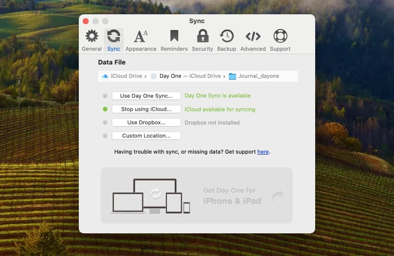

# Day One Classic to Markdown Converter

Convert your Day One Classic entries to Markdown.

## Summary
This shell script uses `plutil` to extract Entry Text and Tags from each Day One entry. A new file is created for each entry in a new export folder within the same directory using the Creation Date timestamp and an MD5 hash.

The following keys are included in the export:
- Creation Date
- Entry Text
- Tags

## Limitations
The primary goal of this script was to extract text content of a Day One Classic journal instead of metadata or media. The following are not included in the exported Markdown files:
- Activity
- Creator
- Ignore Step Count
- Location
- Music
- Publish URL
- Starred
- Step Count
- Time Zone
- UUID
- Weather

## Usage
1. Find your Day One Classic entries files from Day One > Settings… > Sync.
2. Copy this folder somewhere it can be modified without affecting the original files.
3. Copy the script.sh file into the folder.
4. Give the script permissions to execute by running `chmod u+x ./script.sh`.
5. Run the script using `./script.sh`.
6. Observe a new folder is created called exports where your entries were converted into Markdown.

## Day One Classic Entries


Day One Classic stores entries as plist (Property List) files, an XML format popular on Apple software for quickly storing data without having to manage a database. Day One 2 moved to SQLite3. If you have other media in your journal, they will be stored in separate folders.

## Entry Format
The following is what entries look like in their plist format. Content formatted with brackets has been redacted, e.g. `[iPhone]`.

```xml
<?xml version="1.0" encoding="UTF-8"?>
<!DOCTYPE plist PUBLIC "-//Apple//DTD PLIST 1.0//EN" "http://www.apple.com/DTDs/PropertyList-1.0.dtd">
<plist version="1.0">
<dict>
	<key>Creation Date</key>
	<date>2014-10-23T15:36:33Z</date>
	<key>Creator</key>
	<dict>
		<key>Device Agent</key>
		<string>iPhone/iPhone6,1</string>
		<key>Generation Date</key>
		<date>2014-10-23T15:36:33Z</date>
		<key>Host Name</key>
		<string>[Device Name]</string>
		<key>OS Agent</key>
		<string>iOS/8.0.2</string>
		<key>Software Agent</key>
		<string>Day One iOS/1.15.1</string>
	</dict>
	<key>Entry Text</key>
	<string>Today's the day!</string>
	<key>Ignore Step Count</key>
	<true/>
	<key>Location</key>
	<dict>
		<key>Administrative Area</key>
		<string>[State Code, e.g. NY]</string>
		<key>Country</key>
		<string>United States</string>
		<key>Latitude</key>
		<real>[30.123456789012345]</real>
		<key>Locality</key>
		<string>[City]</string>
		<key>Longitude</key>
		<real>[-30.123456789012345]</real>
		<key>Place Name</key>
		<string>[123 Cole St.]</string>
		<key>Region</key>
		<dict>
			<key>Center</key>
			<dict>
				<key>Latitude</key>
				<real>[30.123456789012345]</real>
				<key>Longitude</key>
				<real>[-30.123456789012345]</real>
			</dict>
			<key>Radius</key>
			<real>69.809858438969187</real>
		</dict>
	</dict>
	<key>Music</key>
	<dict>
		<key>Album</key>
		<string>Mickey Mouse Operation</string>
		<key>Album Year</key>
		<string>2006</string>
		<key>Artist</key>
		<string>Little People</string>
		<key>Track</key>
		<string>Start Shootin'</string>
	</dict>
	<key>Publish URL</key>
	<string>[https://dayone.me/1DfZzie]</string>
	<key>Starred</key>
	<false/>
	<key>Step Count</key>
	<integer>3851</integer>
	<key>Tags</key>
	<array>
		<string>quote</string>
	</array>
	<key>Time Zone</key>
	<string>US/Pacific</string>
	<key>UUID</key>
	<string>[FE8C4DDF45B14BAEBDD0E2988CD301E0]</string>
	<key>Weather</key>
	<dict>
		<key>Celsius</key>
		<string>14</string>
		<key>Description</key>
		<string>Mostly Cloudy</string>
		<key>Fahrenheit</key>
		<string>58</string>
		<key>IconName</key>
		<string>pcloudy.png</string>
		<key>Pressure MB</key>
		<real>1017.67</real>
		<key>Relative Humidity</key>
		<real>91</real>
		<key>Service</key>
		<string>Forecast.io</string>
		<key>Visibility KM</key>
		<real>15.08</real>
		<key>Wind Bearing</key>
		<integer>144</integer>
		<key>Wind Speed KPH</key>
		<real>3.5099999999999998</real>
	</dict>
</dict>
</plist>
```

## Alternatives
- [karyslav](https://github.com/karyslav) uses AppleScript in [DayOneClassicMD-to-Separete-MarkDown-files](https://github.com/karyslav/DayOneClassicMD-to-Separete-MarkDown-files/tree/main) to parse a single Markdown file by the "Date:" delimiter.
- If you're using Day One 2, use [indyandie](https://github.com/Indyandie)'s [Last Day](https://github.com/Indyandie/last-day) script.
